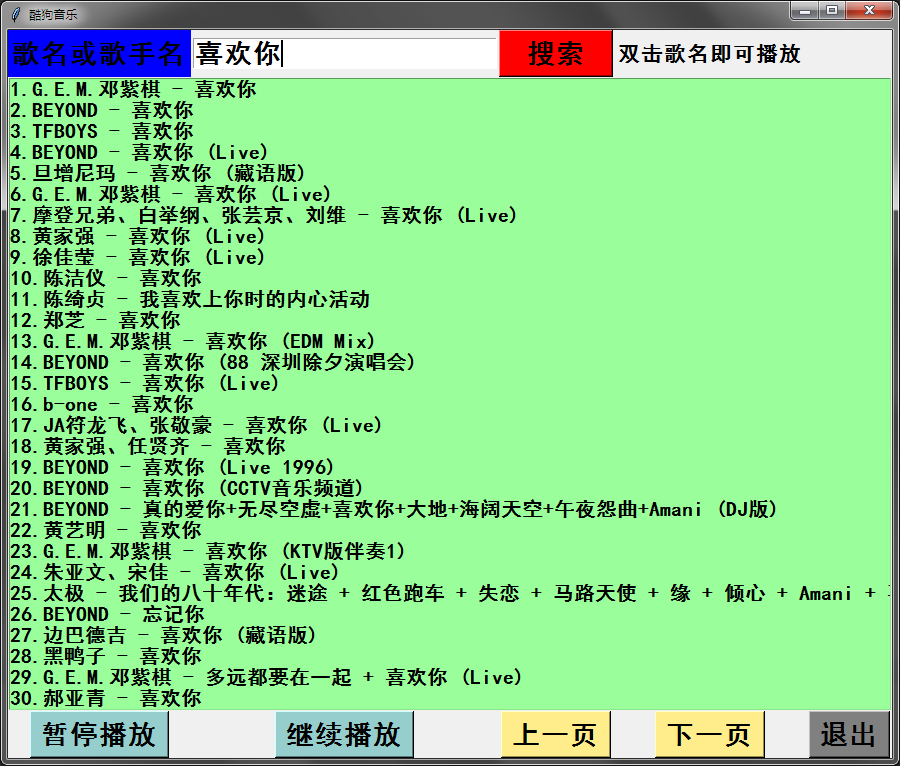

酷狗音乐GUI桌面程序 
===========================
   
### 酷狗音乐官网 - http://www.kugou.com/
|Author|:sunglasses:Henryhaohao:sunglasses:|
|---|---
|Email|:hearts:1073064953@qq.com:hearts:

    
****
## :dolphin:声明
### 软件仅用于学习交流，请勿用于任何商业用途！感谢大家！
### 如果大家有别的想要添加的音乐平台，可以根据我的另一个Github项目[API_Music_Download](https://github.com/Henryhaohao/API_Music_Download)进行参考并添加，欢迎大家来Fork and Pull！  
## :dolphin:介绍
### 该项目为[酷狗音乐](http://www.kugou.com/)在线听歌的GUI桌面程序。
 - 项目目录:
    - 爬虫文件: Spiders/API_music_kugou.py
    - Tkinter GUI文件: Spiders/GUI_music_kugou.py
    - exe运行程序: exe/GUI_music_kugou.exe (使用pyinstaller库将python文件打包成可执行的exe程序)
 - 以下是软件界面截图:

## :dolphin:运行环境
Version: Python3
## :dolphin:安装依赖库
```
pip3 install -r requirements.txt
```